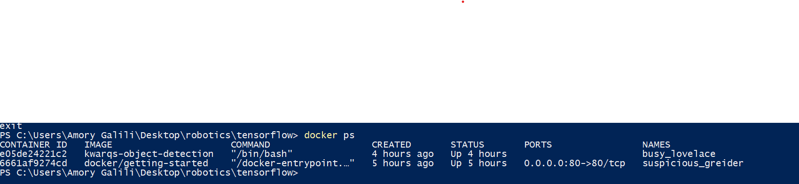
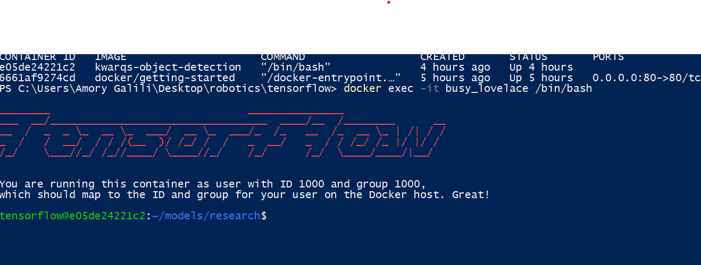
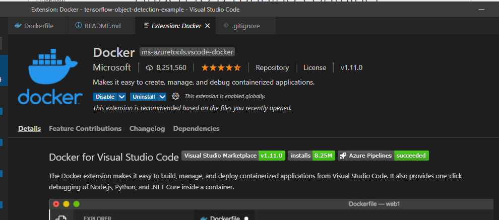
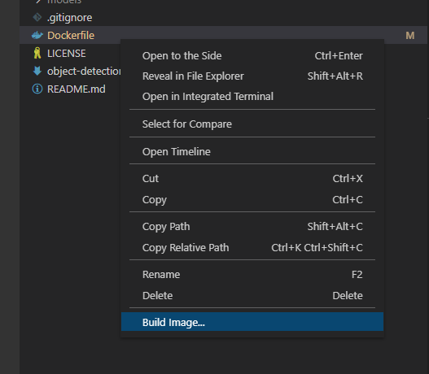
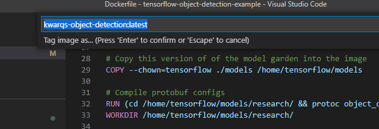
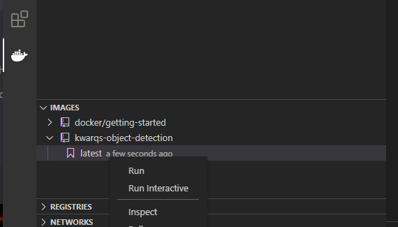
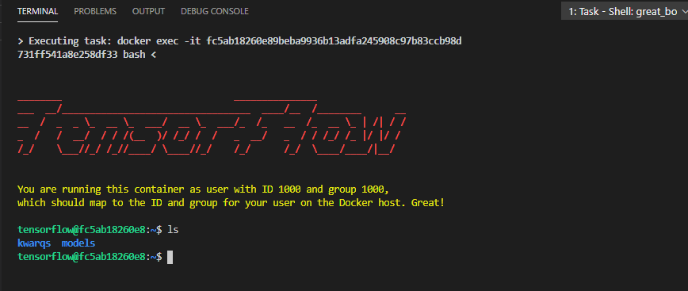
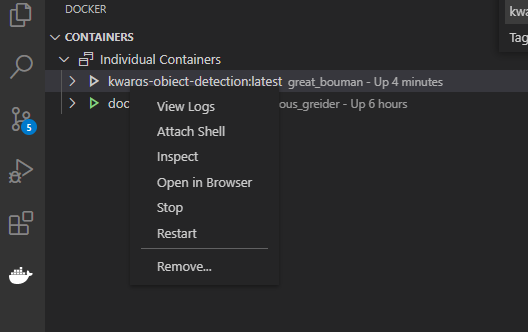

## Installation

Clone this repo and cd into to it:

```
git clone https://github.com/frc2423/tensorflow-object-detection-example.git
cd tensorflow-object-detection-example
```

From the **tensorflow-object-detection-example** directory run these commands:

```
git clone https://github.com/tensorflow/models.git
docker build -f ./Dockerfile -t kwarqs-object-detection .
```

## Running

```
docker run --privileged --device=/dev/video0:/dev/video0 -it kwarqs-object-detection
```

To access the running container first get its name by running ```docker ps``` in the terminal:



And then run ```docker exec -it -p 6006:6006 [container name] /bin/bash```:



## Developing in VS Code

To develop in vscode first install the docker extension:



To update the docker image, right click the **Dockerfile** in vscode and click *Build Image...*:




Tag the image as **kwarqs-object-detection:latest** and press enter:



To run the image right the *kwarqs-object-detection:latest* image in the docker vscode extension and click *Run Interactive*:



This should launch a shell in vscode into the container:



To launch another shell, stop and start the container, and perform other actions right click the container in vscode:



## Generating the model

From the **kwarqs** directory inside the container generate the TFRecords:

```
python generate_tfrecord.py --csv_input=images/train_labels.csv --image_dir=images/train --output_path=training/content/train.record
python generate_tfrecord.py --csv_input=images/test_labels.csv --image_dir=images/test --output_path=training/content/test.record
```

To train the model, execute the following command in the command line:

```
python ../models/research/object_detection/model_main_tf2.py --pipeline_config_path=training/ssd_efficientdet_d0_512x512_coco17_tpu-8.config --model_dir=training --alsologtostderr
```

Run tensorboard to visualize training of the model:

```
tensorboard --logdir=training/train --host 0.0.0.0 --port 6006
```

When you are done training, run this to generate the inference graph that can be used to run the model:

```
python ../models/research/object_detection/exporter_main_v2.py --trained_checkpoint_dir training --output_directory inference_graph --pipeline_config_path training/ssd_efficientdet_d0_512x512_coco17_tpu-8.config
```

To detect objects with your webcam using the model you trained run this script:

```
python detect_from_webcam.py --labelmap training/content/labelmap.pbtxt --model inference_graph/saved_model
```
